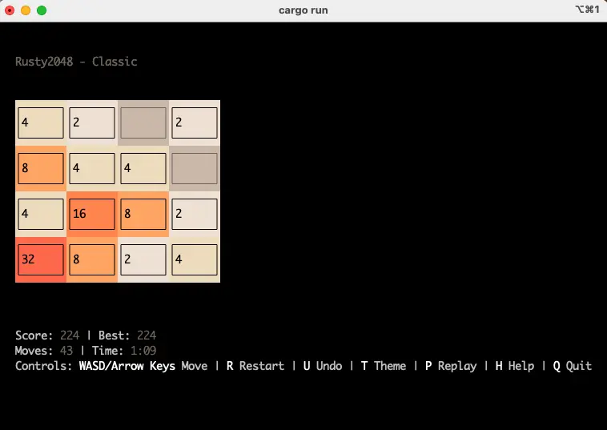
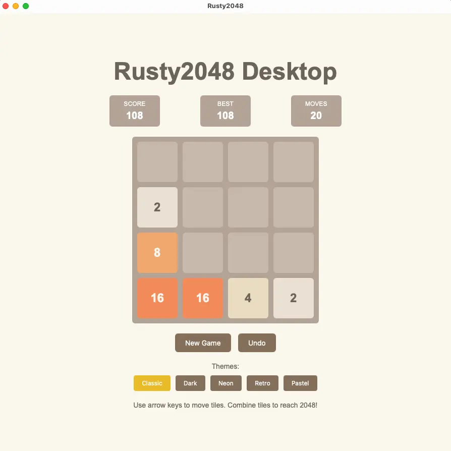
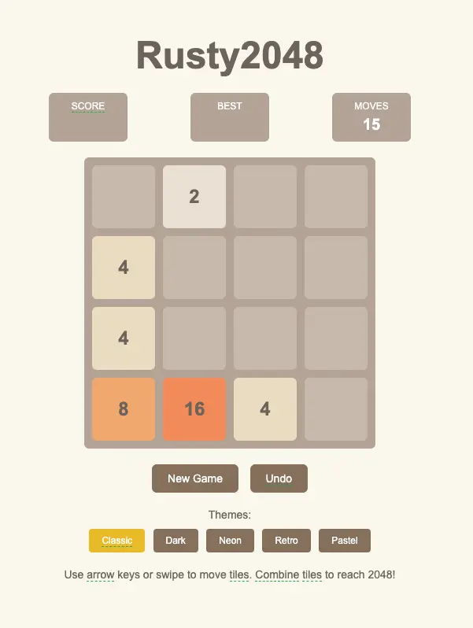

# Rusty2048 🎮

A modern implementation of the 2048 game written in Rust, supporting multi-platform deployment.

## 🖼️ Screenshots

<div align="center">
  
  
  
</div>

## ✨ Features

- **High Performance**: Built with Rust, zero-cost abstractions
- **Cross-Platform**: Supports CLI, Web, and Desktop versions
- **Modern UI**: Smooth animations and beautiful interfaces
- **Configurable**: Customizable board size, target score, and more
- **Replay System**: Record and replay game sessions (CLI version)
- **AI Mode**: Three AI algorithms with auto-play (CLI version)
- **Statistics Charts**: Comprehensive game analytics and visualizations (CLI version)
- **Theme System**: 5 beautiful themes (Classic, Dark, Neon, Retro, Pastel)
- **Real-time Statistics**: Display current score, best score, moves, and game duration
- **Game Over Handling**: Show detailed statistics when no moves are possible
- **Victory Notification**: Display victory message when reaching 2048
- **Score Animation**: Score flashes when tiles merge
- **Sound Feedback**: Play bell sound when score increases

## 🏗️ Project Architecture

```
rusty2048/
├── core/           # Core game logic library
├── cli/            # Command-line version (TUI)
├── web/            # Web version (WASM)
├── desktop/        # Desktop version (Tauri)
└── shared/         # Shared components
```

## 🚀 Quick Start

### CLI Version

```bash
# Build and run the CLI version
cargo run -p rusty2048-cli

# Or navigate to cli directory
cd cli && cargo run
```

### Desktop Version
```bash
# Build the desktop version
cd desktop && ./build.sh
# Run in development mode
cd desktop && cargo tauri dev
```

### Web Version

```bash
# Build the web version
cd web && ./build.sh

# Serve the web version locally
cd web/dist && python3 -m http.server 8000
# Then open http://localhost:8000 in your browser
```

### Controls

#### CLI Version
- **Arrow Keys** or **WASD**: Move tiles
- **R**: Restart game
- **U**: Undo last move
- **T**: Cycle through themes
- **1-5**: Select theme directly (1=Classic, 2=Dark, 3=Neon, 4=Retro, 5=Pastel)
- **H**: Toggle theme help
- **P**: Enter replay mode
- **C**: Toggle statistics charts
- **I**: Toggle AI mode
- **Q** or **ESC**: Quit game

**Replay Mode Controls:**
- **1**: Start recording new game
- **2**: Load and play replay
- **3**: List saved replays
- **4**: Back to main menu
- **Space**: Play/Pause replay
- **Left/Right**: Step through replay
- **+/-**: Adjust replay speed
- **S**: Stop recording

**AI Mode Controls:**
- **O**: Toggle auto-play
- **[ ]**: Switch between AI algorithms (Greedy ↔ Expectimax ↔ MCTS)
- **+/-**: Adjust AI speed (100ms-2000ms)
- **Q/ESC**: Exit immediately (even during auto-play)

**Charts Controls:**
- **Left/Right**: Navigate between chart modes
- **C**: Toggle charts display

#### Desktop Version
- **Arrow Keys** or **WASD**: Move tiles
- **Mouse**: Click buttons for New Game, Undo
- **Theme Buttons**: Click to switch themes

#### Web Version
- **Arrow Keys** or **WASD**: Move tiles
- **Mouse/Touch**: Click buttons for New Game, Undo
- **Theme Buttons**: Click to switch themes
- **Mobile**: Swipe gestures supported

### Game Features

- **Real-time Statistics**: Display current score, best score, moves, and game duration
- **Game Over Handling**: Show detailed statistics when no moves are possible
- **Victory Notification**: Display victory message when reaching 2048
- **Score Animation**: Score flashes when tiles merge
- **Sound Feedback**: Play bell sound when score increases
- **Theme System**: 5 beautiful themes (Classic, Dark, Neon, Retro, Pastel)
- **Replay System**: Record and replay game sessions with full controls

## 🎬 Replay System

The CLI version includes a comprehensive replay system that allows you to:

### Features
- **Record Games**: Automatically record all moves during gameplay
- **Save Replays**: Save completed games with metadata
- **Play Back**: Watch replays with full playback controls
- **Speed Control**: Adjust playback speed (0.5x to 4x)
- **Step Through**: Move forward/backward one move at a time
- **File Management**: Organized storage in `cli/replays/` folder

### File Format
Replay files are saved as JSON and include:
- Complete game configuration
- Initial board state
- All moves with timestamps
- Final statistics and metadata
- Player information and notes

### Usage
1. Press **P** during gameplay to enter replay mode
2. Choose **1** to start recording a new game
3. Play normally - all moves are automatically recorded
4. Press **S** to stop recording and save
5. Choose **2** to load and play back saved replays

## 🤖 AI Mode

The CLI version includes an advanced AI system that can play the game automatically:

### AI Algorithms
- **Greedy**: Simple algorithm that chooses the move with highest immediate score
- **Expectimax**: Advanced search algorithm that considers future moves and random tile placements
- **MCTS**: Monte Carlo Tree Search with UCB1 formula for optimal decision making

### Features
- **Auto-play**: Watch AI play the game automatically
- **Speed Control**: Adjust AI move speed from 100ms to 2000ms
- **Algorithm Switching**: Switch between different AI algorithms in real-time
- **Real-time Status**: Display current algorithm, auto-play state, and speed
- **Non-blocking**: AI runs smoothly without blocking user input

### Usage
1. Press **I** to enter AI mode
2. Press **O** to start auto-play
3. Use **[ ]** to switch between algorithms
4. Use **+/-** to adjust speed
5. Press **Q** to exit at any time

## 📊 Statistics Charts

The CLI version includes comprehensive statistics and analytics:

### Chart Types
- **Summary**: Overall statistics including games played, win rate, highest scores
- **Score Trend**: Visual chart showing score progression over last 20 games
- **Efficiency Trend**: Chart displaying efficiency (score per move) over time
- **Tile Achievements**: Bar chart showing how often each tile value was achieved
- **Recent Games**: Table of the last 10 games with detailed statistics

### Features
- **Automatic Recording**: All games are automatically recorded when they end
- **Real-time Updates**: Charts update immediately when new data is available
- **Visual Analytics**: ASCII-based charts for terminal display
- **Data Persistence**: Statistics are saved to `cli/stats.json` for long-term tracking
- **Performance Metrics**: Track efficiency, average scores, and improvement trends

### Usage
1. Press **C** to toggle charts display
2. Use **Left/Right** arrow keys to navigate between chart types
3. Charts show alongside the game board for easy comparison
4. Statistics are automatically updated after each game

## 🛠️ Development

### Requirements

- Rust 1.70+
- Cargo

### Project Structure

- `core/`: Core game logic, including board, moves, scoring, replay system, etc.
- `cli/`: Command-line interface using ratatui and crossterm
- `web/`: Web version using wasm-bindgen
- `desktop/`: Desktop version using Tauri
- `shared/`: Shared components like themes and configurations

### Testing

```bash
# Run all tests
cargo test

# Run benchmarks
cargo bench

# Run property tests
cargo test --features proptest
```

## 📦 Build Targets

### CLI Version
```bash
cargo build --release -p rusty2048-cli
```

### Web Version
```bash
cd web && ./build.sh
# Files will be generated in web/dist/
```

### Desktop Version
```bash
cd desktop && cargo tauri build
# Or run in development mode
cd desktop && cargo tauri dev
```

## 🎯 Development Roadmap

### ✅ Completed
- [x] Core game logic
- [x] CLI version basic functionality
- [x] CLI version game over handling
- [x] CLI version score statistics and animations
- [x] CLI version theme system
- [x] Web version (WASM)
- [x] Desktop version (Tauri)
- [x] Replay system (CLI version)
- [x] AI mode (CLI version)
- [x] Statistics charts (CLI version)

### 🔄 Future Enhancements
- [ ] Multi-language support
- [ ] AI mode for Web/Desktop versions
- [ ] Replay system for Web/Desktop versions
- [ ] Statistics charts for Web/Desktop versions

## 📄 License

This project is licensed under the MIT License - see the [LICENSE](LICENSE) file for details.

**Enjoy the game!** 🎉
