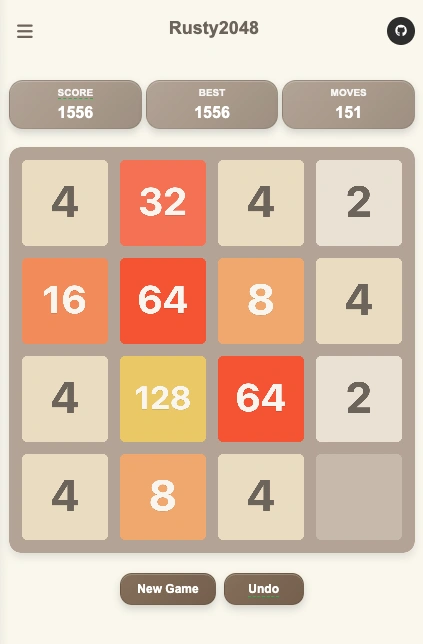

# Rusty2048 🎮

A modern implementation of the 2048 game written in Rust, supporting multi-platform deployment.

## 🖼️ Screenshots

<div align="center">
  
  
  
</div>

## ✨ Features

- **High Performance**: Built with Rust, zero-cost abstractions
- **Cross-Platform**: Supports CLI, Web, and Desktop versions
- **Multi-language Support**: English and Chinese localization
- **Modern UI**: Smooth animations and beautiful interfaces
- **AI Mode**: Three AI algorithms with auto-play (CLI and Web versions)
- **Theme System**: 5 beautiful themes (Classic, Dark, Neon, Retro, Pastel)
- **Replay System**: Record and replay game sessions (CLI version)
- **Statistics Charts**: Comprehensive game analytics (CLI version)

📖 **[View Full Feature List](docs/FEATURES.md)** - Detailed information about all features, controls, and capabilities.

📚 **[Browse All Documentation](docs/)** - Complete documentation index and guides.

## 🏗️ Project Architecture

```
rusty2048/
├── core/           # Core game logic library
├── cli/            # Command-line version (TUI)
├── web/            # Web version (WASM)
├── desktop/        # Desktop version (Tauri)
└── shared/         # Shared components
```

## 🚀 Quick Start

### Build All Versions

```bash
# Build all versions (CLI, Web, Desktop)
./build.sh

# Or build specific versions
./build.sh cli      # CLI version only
./build.sh web      # Web version only
./build.sh desktop  # Desktop version only
```

### Run Different Versions

```bash
# Run CLI version
./run.sh cli

# Run Web version (serves on localhost:8000)
./run.sh web

# Run Desktop version
./run.sh desktop
```

### Manual Build (Alternative)

#### CLI Version
```bash
cargo run -p rusty2048-cli
```

#### Desktop Version
```bash
cd desktop && cargo tauri dev
```

#### Web Version
```bash
cd web && ./build.sh
cd web/dist && python3 -m http.server 8000
```

**🌐 Live Demo**: [Play on Vercel](https://rusty2048.vercel.app)

## 🎮 Basic Controls

- **Arrow Keys** or **WASD**: Move tiles
- **Mouse/Touch**: Click buttons for New Game, Undo
- **Language Button**: Switch between English and Chinese
- **Theme Buttons**: Switch between 5 beautiful themes

📖 **[View Complete Controls](docs/FEATURES.md#-controls)** - Detailed controls for all versions and modes.

## 🛠️ Development

### Requirements

- Rust 1.70+
- Cargo

### Project Structure

- `core/`: Core game logic, including board, moves, scoring, replay system, etc.
- `cli/`: Command-line interface using ratatui and crossterm
- `web/`: Web version using wasm-bindgen
- `desktop/`: Desktop version using Tauri
- `shared/`: Shared components like themes and configurations

### Testing

```bash
# Run all tests
cargo test

# Run benchmarks
cargo bench

# Run property tests
cargo test --features proptest
```

## 📦 Build Targets

### Using Root Scripts (Recommended)
```bash
# Build all versions
./build.sh

# Build specific versions
./build.sh cli      # CLI version
./build.sh web      # Web version  
./build.sh desktop  # Desktop version
```

### Manual Build Commands
```bash
# CLI Version
cargo build --release -p rusty2048-cli

# Web Version
cd web && ./build.sh

# Desktop Version
cd desktop && cargo tauri build
```

## 🎯 Development Roadmap

### ✅ Completed
- [x] Core game logic
- [x] CLI version with full features
- [x] Web version (WASM)
- [x] Desktop version (Tauri)
- [x] Replay system (CLI version)
- [x] AI mode (CLI and Web versions)
- [x] Statistics charts (CLI version)
- [x] Multi-language support (all versions)
- [x] Theme system (all versions)

### 🔄 Future Enhancements
- [ ] AI mode for Desktop version
- [ ] Replay system for Web/Desktop versions
- [ ] Statistics charts for Web/Desktop versions

## 📄 License

This project is licensed under the MIT License - see the [LICENSE](LICENSE) file for details.

**Enjoy the game!** 🎉
